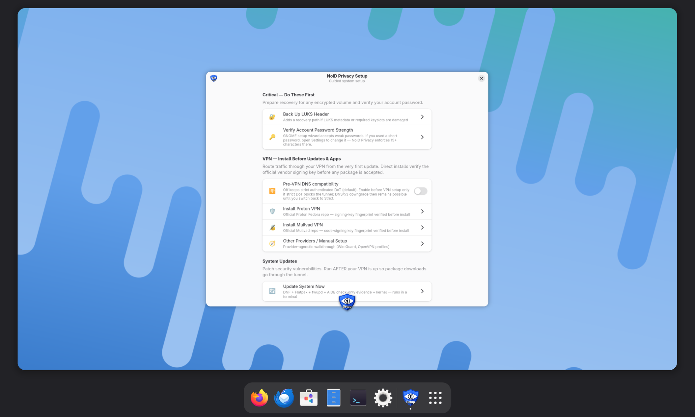

<div align="center">

# 🛡️ NoID Privacy Workstation 44

### Hardened Security + Privacy OS — built for the AI-agent workflow

*Based on Fedora 44 · GNOME 50*

[](https://fedoraproject.org/)
[](CHANGELOG.md)
[](tests/)
[](INDEX.md)
[](docs/build-reproducibility.md)
[](https://noid-privacy.com)
[](https://buymeacoffee.com/noidprivacy)

**A Fedora-derived workstation for Dev · Admin · Creator · AI workflows — no project telemetry, with documented privacy and hardening defaults.**

[📥 Download](#-download-the-iso) · [Quick Start](#-quick-start) · [What You Get](#-what-you-get) · [Scope](#-scope--what-it-is--is-not) · [Threat Model](#️-threat-model) · [AI Workspace](#-ai-agent-ready-workspace) · [Comparison](#-comparison) · [Docs](INDEX.md)

</div>

<p align="center">
  <a href="docs/screenshots/noid-privacy-workstation-44.png">
    
  </a>
</p>

<p align="center"><sub>NoID Privacy Workstation 44 setup on GNOME 50 · click to enlarge</sub></p>

---

A hardened, privacy-trimmed **Fedora Workstation 44** desktop that still works like one —
**41 functional modules** provide the hardening baseline across kernel, network,
identity, integrity, firmware, services and browser, plus first-party apps,
CLIs and docs, packaged as a branded ISO recipe with explicit build and
verification tooling. Complete-ISO byte reproducibility has not been
established.

It's also built for the **AI-agent workflow**: VSCodium ships hardened with a
privacy-default `settings.json` and no vendor agent code; the Claude and Codex
CLIs and their pinned extensions are separate per-user opt-in installs. One
root-managed engineering
doctrine exposed byte-for-byte through Claude Code, Codex/ChatGPT-Codex and Gemini's
documented global instruction paths, a repo-root `AGENTS.md` for Cursor-compatible
project agents, and 52 AI-navigable docs — model access is opt-in, and a
local-inference path (RamaLama / Ollama / LM Studio) is documented for
workloads that must stay on the workstation.

The image is designed as a hardened daily-driver, but some defaults intentionally
trade compatibility and background integrations for a smaller surface. It stays
a GNOME 50 desktop with Flatpak, NetworkManager, Firefox + uBO and dnf; Intel +
AMD GPUs use Mesa, while NVIDIA
defaults to the open nouveau+NVK stack (proprietary NVIDIA + CUDA opt-in). Bluetooth /
Location / Camera / Microphone ship default-off with one-toggle opt-in (`noid-toggle-bluetooth`
/ `noid-toggle-location` / GNOME Settings → Privacy). Shipped relaxation and
opt-in tools document their reverse path and relevant functional costs.
On the expected **Btrfs + Snapper** layout, root-system snapshot rollback covers
the root subvolume while `/home` remains a separate boundary. **LUKS2** is an
independent Anaconda choice that adds at-rest encryption; it is not a
prerequisite for Snapper rollback.

Threat model: **privacy + resistance to common local-network and ISP observation** — not state-level
anonymity. Per-module rationale lives inline in each `.ks` file's header and
implementation comments; deeper trade-offs across [`docs/`](docs/).

> **⚠️ Trademark:** "Fedora" is a registered trademark of Red Hat, Inc. NoID Privacy Workstation
> is an independent derivative work, **not affiliated with, endorsed by, or sponsored by the
> Fedora Project or Red Hat, Inc.** — [details](docs/trademark-notice.md).

---

## 📥 Download the ISO

The public download page continues to identify the currently hosted artifact;
verify its displayed version and signature rather than inferring it from the
source-tree version. The ready-to-flash, GPG-signed ISO lives on the
**[NoID Privacy download page →](https://noid-privacy.com/linux.html)** — hosted on the
project site, not GitHub Releases. GitHub requires every release asset to be under 2 GiB.

**Always verify before you boot:**

```bash
gpg --import noid-privacy-release.asc      # one-time: import the release key
gpg --verify SHA256SUMS.asc SHA256SUMS     # → "Good signature"
sha256sum -c SHA256SUMS                    # → "...x86_64.iso: OK"
```

Release signing-key fingerprint `1ACB FCE4 9687 FEBB 9101 0E52 F8E3 F11D 6962 256F`
([download the key](https://noid-privacy.com/downloads/noid-privacy-release.asc)).

> Prefer to **build it yourself** from the kickstart source? See [Quick Start](#-quick-start) below.

---

## ⚡ Quick Start

> **Build the ISO yourself** on a Fedora 44 host:

```bash
# On a Fedora 44 build host:
sudo dnf install lorax-lmc-virt lorax-lmc-novirt anaconda pykickstart genisoimage \
  git curl patch ShellCheck
git clone https://github.com/NexusOne23/noid-privacy-workstation.git
cd noid-privacy-workstation
# Put Fedora-Server-netinst-x86_64-44-1.7.iso in /var/tmp/ or ~/Downloads/.
# The wrapper fetches the audit payload from its immutable public commit URL
# and independently enforces its reviewed version, byte count and SHA-256.
sudo -v                            # cache privilege for the wrapper's root-only steps
./scripts/build-iso.sh              # atomically publishes a unique unsigned candidate
```

`scripts/build-iso.sh` is the **single supported build path** — it handles ksflatten, the
Anaconda patch, mandatory verified branding staging, and audit-tool SHA pinning.
Run the wrapper as the normal user; it invokes `sudo` only where required. The
ISO checksum remains unsigned until the complete installed-VM release gates
pass. Full guide: [`docs/build.md`](docs/build.md).

**Always VM-test before bare-metal:**

```bash
git clone https://github.com/NexusOne23/noid-privacy-linux.git ../noid-privacy-linux
git -C ../noid-privacy-linux checkout e204bb68a7ac3ce08acc685fb56356d460ba3710
NOID_AUDIT_SRC=../noid-privacy-linux/noid-privacy-linux.sh bash tests/run-all.sh  # 84 structural tests
sudo ./tests/smoke/run-all.sh      # bwrap smoke tests (needs bubblewrap)
```

Before a release signature, install the exact candidate in a fresh VM, complete
the live/install/reboot matrix in [`docs/release-process.md`](docs/release-process.md),
review the external-storage evidence in
[`docs/external-storage-policy.md`](docs/external-storage-policy.md),
and run `tests/pre-ship/29-installed-package-freshness.sh` inside that installed
VM with its controlled WAN enabled.

## 🀄 中文簡介 | 中文简介

**繁體中文：** NoID Privacy Workstation 44 是基於 Fedora 44 + GNOME 50 的強化安全隱私作業系統：41 個功能模組涵蓋縱深防禦、第一方工具與文件（SELinux enforcing、不可變 auditd、AIDE、USBGuard、firewalld DROP 預設、LAN 隔離），內建 AI 代理工作區，可從公開原始碼建置（主要程式碼採 GPL-3.0-or-later，另有逐檔例外）。中文介紹與 ISO 驗證：[noid-privacy.com（繁體中文）](https://noid-privacy.com/hardened-linux-privacy-os-zh-hant.html)

**简体中文：** NoID Privacy Workstation 44 是基于 Fedora 44 + GNOME 50 的加固安全隐私操作系统：41 个功能模块涵盖纵深防御、第一方工具与文档（SELinux enforcing、不可变 auditd、AIDE、USBGuard、firewalld DROP 默认、LAN 隔离），内置 AI 代理工作区，可从公开源代码构建（主要代码采用 GPL-3.0-or-later，另有逐文件例外）。中文介绍与 ISO 验证：[noid-privacy.com（简体中文）](https://noid-privacy.com/hardened-linux-privacy-os-zh-hans.html)

---

## 📦 What Ships in the Repo

A **kickstart image recipe** — not a pre-built ISO:

- **43 kickstart files** — `master.ks` + 42 snippets: 41 functional modules
  (hardening + first-party apps + branding + docs) and the
  `99-finalize.ks` cross-module verifier. The snippets span
  the hardening surface (sysctl, firewall, USBGuard, AIDE, SELinux, kernel-module
  blacklist, …), first-party NoID Privacy apps and CLIs, user-doc bundles, branding,
  and post-install cleanup — not all are "hardening" in the narrow sense. The wrapper
  `scripts/build-iso.sh` flattens them and feeds `livemedia-creator` to produce a
  bootable live ISO.
- **52 user-doc pages** shipped inside the image at `/usr/share/doc/noid-privacy/` — written
  for humans and structured so an AI-agent (e.g., a Claude Code session) can navigate + read
  them on demand.
- **A user-facing helper suite** (`noid-status`, `noid-help`, `noid-update-all.sh`,
  `noid-update` GUI, `noid-network` GUI, `noid-welcome.sh`, `noid-integrity-check`,
  `noid-toggle-wan-strict`, `noid-toggle-bluetooth`, `noid-toggle-location`,
  `noid-toggle-aide`, `noid-toggle-fedora-flatpaks`, `noid-snap-pre`, `noid-luks-backup.sh`,
  `noid-firefox-harden-profile`, `noid-firefox-create-isolated-profile`,
  `noid-mei-restore-submodules`, `noid-lan-allow`, `noid-claude-install`,
  `noid-nvidia-install.sh`, …) in `/usr/local/bin` and `/usr/local/sbin`.
- **84 structural + 4 smoke regression tests** covering critical module invariants —
  current state **84/84 PASS**.

Once built and installed, the result is a Fedora
Workstation with an intentionally broader hardening baseline than stock Fedora in the areas
listed and tested here; it is not a claim of superiority in every possible dimension.
Disk encryption and the expected Btrfs layout depend on the choices made in Anaconda.
Side-by-side against Kicksecure + secureblue → [Comparison](#-comparison).

---

## 🏰 What You Get

| Area | Hardening |
|---|---|
| **🤖 AI workspace** | Hardened VSCodium (no vendor agent code shipped) + opt-in installers for the pinned native Claude/Codex CLIs and their extensions + privacy-default settings + one system doctrine with native Claude Code, Codex and Gemini adapters + repo-root `AGENTS.md` for Cursor-compatible project agents + 52 AI-navigable user docs. Full breakdown → [AI-Agent-Ready Workspace](#-ai-agent-ready-workspace) |
| **🔥 LAN isolation** | Physical Ethernet/Wi-Fi is forced into inbound DROP; 37 static rules and a topology-aware nftables guard block host traffic to every directly connected prefix. A default-drop native-or-generic XDP/TC boundary rejects unsolicited non-ARP physical ingress before ordinary raw packet taps and admits gateway IPv4 only as bounded replies to observed egress flows. Standard ARP remains visible for RFC 5227 conflict detection and normal link operation; exact permanent gateway/approved-peer neighbours resist ordinary cache replacement without authenticating Ethernet. An XDP-only incompatibility retains the lower firewall/nft layers and WAN repair access but is reported prominently as degraded. Per-IP access is an explicit action through the **`noid-network`** app or its supported **`noid-lan-allow`** backend CLI. Firmware OOB such as Intel AMT remains a separate prerequisite. Exact device/update boundary: [`docs/hardware-network-compatibility.md`](docs/hardware-network-compatibility.md) |
| **🛰️ VPN safety layer** | Provider-neutral validation places genuine VPN interfaces in inbound-DROP `noid-vpn`. After a supported profile is parsed, WAN-strict permits only exact saved VPN endpoint `IP + TCP/UDP + port` tuples on physical links; unknown schemas fail closed. Provider route/DNS behavior remains separately verifiable |
| **🧠 Kernel & sysctl** | Tested sysctl, kernel-command-line and module-blocklist baselines derived from KSPP/Kicksecure references plus project-specific network controls; selected services receive `Protect*` / `Restrict*` systemd layers. Exact source counts are regression-tested, not security scores |
| **🔐 Firmware** | Intel ME host surface: KT/SOL PCI host-driver binding blocked across 27 IDs + `mei`/`mei_me` retained for fwupd visibility; generic IOMMU/Secure Boot/lockdown harden the host but do not disable AMT. The required UEFI/MEBx unprovision/disable and all-AMT-network-path checklist is explicit because AMT OOB bypasses host firewalls. Optional `mei_hdcp`/`mei_pxp`/`mei_wdt` blocks document their trade-offs. AMD PSP: awareness/visibility and opt-in `ccp` blacklist only; no software-disable claim. Plus **USBGuard** whitelist-only |
| **🔍 Integrity & audit** | SELinux **enforcing** (+ custom NoID Privacy module), auditd **immutable** (132 b64/b32-complete rules, `-e 2`), AIDE installed with checks disabled until the user reviews and accepts an exact baseline candidate, one-screen `noid-status`, curated known-FP list |
| **🦊 Browser and mail** | Locally maintained NoID Privacy Firefox Hardening (reviewed derivative of the arkenfox v144.0 snapshot; no automatic upstream import) + SHA-pinned uBlock Origin + FPP overrides + provider-compatible system/VPN DNS (strict global/physical Quad9; best-effort opportunistic on unset VPN/private profiles) + dFPI; separate Playground profile. Thunderbird uses the same local-derivative model for its HorlogeSkynet v140.2 basis and includes blocked remote content, disabled Mozilla telemetry prefs and a SHA-pinned DKIM Verifier whose TXT lookups follow the active OS/VPN resolver by default |
| **🔇 Silent machine** | Explicit cross-module service/socket/timer masks suppress unused discovery, printing, firmware polling, package-cache and remote-access surfaces. The complete project-owned automatic-execution review distinguishes resident processes, one-shots, timers, paths and event hooks instead of treating every enabled unit as a daemon. Location/GeoClue is default-off through the user setting, updates are user-initiated (the weekly timer is notification-only), and GNOME Software background activation is suppressed while manual Flatpak-only launch and a named, non-persistent Fedora-RPM view remain available → [`docs/automatic-execution.md`](docs/automatic-execution.md) |
| **💾 Storage** | When encryption is selected in Anaconda, the module detects and documents the resulting LUKS configuration; it does not force a cipher/KDF or enroll TPM2 auto-unlock. On the expected Btrfs root layout, Snapper provides pre-update root snapshots and the checked `noid-snap-rollback` workflow; `/home` remains a separate boundary and GRUB does not list snapshots. See [`docs/22-disk-encryption.md`](docs/22-disk-encryption.md). |
| **🕒 30-day retention boundary** | Scheduled jobs remove older records from the explicitly listed NoID Privacy-managed logs and histories. Deletable Snapper snapshots use the same measured 30-day target; active/default roots, discontinuous clocks and daemon-owned live state use their documented safe lifecycle boundaries. Source size/count ceilings can evict records earlier. Exact scope and limits: [`docs/log-retention.md`](docs/log-retention.md). |
| **🔄 Updates & UX** | `noid-update-all.sh` orchestrator + `noid-update` GTK4 GUI front-end (snapshot → dnf → flatpak → fwupd → check against the user-owned AIDE baseline), `noid-welcome` setup dialog and the shipped `noid-*` helper/documentation suite |
| **🎮 Gaming** *(opt-in)* | Hardening leaves userns, `/home` execution, SMT and `ntsync` available; `vm.max_map_count` remains Fedora vendor policy rather than a NoID Privacy performance promise. **Gaming Mode** relaxes the two image-controlled compatibility blocks (`ia32_emulation` 32-bit exec + `selinuxuser_execmod` Wine W^X), then installs Steam on demand only after the required reboot makes i686 execution live. SELinux stays enforcing and a reverse toggle restores the policy. Per-title Proton and anti-cheat compatibility remain upstream-dependent → [`docs/gaming.md`](docs/gaming.md) |

Module-by-module breakdown → **[`INDEX.md`](INDEX.md)** · per-module rationale → [`docs/`](docs/).

---

## 🎯 Scope — what it IS / is NOT

| ✅ Does | ❌ Does **not** |
|---|---|
| Block useful host LAN traffic by default (inbound physical DROP + directly connected-prefix egress guard; explicit per-IP exceptions) | Replace Tails / Whonix for whistleblowing anonymity |
| Reduce ISP DNS visibility and browser fingerprintability (strict authenticated global + physical Quad9 DoT, best-effort opportunistic DNS on unset VPN/private links, the local NoID Privacy Firefox derivative, FPP and uBO; destination IP/timing remain without VPN, and opportunistic modes permit DNS/53 fallback) | Provide VM-level isolation like Qubes OS |
| Reduce Intel MEI host attack surface and document the mandatory AMT UEFI/hardware boundary; document AMD PSP limits | Protect against compromised firmware or a compromised VPN provider |
| Enforce SELinux + auditd; support installer-selected LUKS2 and Fedora's signed chain when firmware Secure Boot is enabled | Defeat physical coercion (xkcd 538) |
| Run as a working GNOME 50 + Flatpak desktop | Run on ARM / Raspberry Pi (x86_64 only) |
| User-reviewed AIDE monitoring + Snapper rollback | Centrally manage via AD / LDAP / Intune |

This image combines **configuration hardening** with **AIDE integrity detection**
and **auditd event monitoring** (132 dual-ABI immutable rules). Those layers can surface
selected file drift and audited events after the fact; they do not guarantee
detection of everything hardening fails to prevent.

**Best for:** privacy-aware Fedora power-users · mobile professionals on hostile networks ·
security researchers (source-auditable recipe, explicit per-module rationale) · developers & admins
who accept a WAN-only workflow.
**Not for:** multi-user / family systems (LAN-iso blocks shared services) · enterprise AD/LDAP
(sssd removed) · home-server / NAS · ARM · non-UEFI hardware. TPM 2.0 is optional.
**Gaming:** opt-in via **Gaming Mode** (Setup app) — changes the two repository-managed
compatibility settings (32-bit exec + Wine W^X), then installs Steam through a
separate visible completion step after the required reboot;
the helper verifies/rolls back state and SELinux stays Enforcing. Per-title,
driver and anti-cheat compatibility is not guaranteed. See [`docs/gaming.md`](docs/gaming.md).

---

## 🛡️ Threat Model

See [`docs/threat-model.md`](docs/threat-model.md) for the long version. Short form:

**Mitigates/reduces exposure to** — ad/tracker fingerprinting (the local NoID Privacy Firefox derivative, FPP and uBO); ISP + local-network
surveillance (strict-default global + physical Quad9 DoT, optional VPN, LAN-iso); data-broker profiling (dFPI, MAC randomization); LAN
attacks (`block-lan-out`, permanent gateway/approved-peer neighbour pins); the impact of some browser compromises
(Firefox process isolation, seccomp and namespaces); selected kernel attack
surfaces (sysctl + module blacklist + kargs); unapproved USB devices (USBGuard);
offline data access when LUKS is selected; and selected firmware-facing host surfaces.
Secure Boot contributes only when enabled and correctly anchored by the firmware;
neither it nor LUKS is a complete evil-maid defense.
Intel KT/SOL host-driver binding is blocked, but AMT OOB requires UEFI/MEBx disablement and
removal of every AMT-capable network path; AMD PSP awareness includes an opt-in `ccp`
blacklist with explicit functional costs. Package
supply-chain uses Fedora primary repos with GPG signatures verified; selected
third-party repository keys use pinned full fingerprints and local verified key
files, while their package repositories remain trusted upstreams — see
[`docs/gpg-trust-chain.md`](docs/gpg-trust-chain.md).

**Does NOT protect against** — state-level global traffic analysis; targeted endpoint exploits
(no VM boundary like Qubes); a compromised VPN provider; account-linking via logged-in services
(Gmail / GitHub defeat pseudonymity); physical coercion (xkcd 538); zero-days between disclosure
and patch; upstream supply-chain attacks on Fedora itself (xz-utils-style); social-engineering /
phishing; **vendor-side exposure of AI conversations IF you opt in to Claude Code or
OpenAI Codex** (cloud APIs, US jurisdiction; opt-out paths + fully-local alternative →
[`docs/ai-workspace.md`](docs/ai-workspace.md)). Full out-of-scope list →
[`docs/scope.md`](docs/scope.md).

---

## 🤖 AI-Agent-Ready Workspace

| Layer | Detail |
|---|---|
| **Bundled / opt-in** | Hardened VSCodium (core telemetry and background extension updates off) ships with no vendor agent code. `noid-claude-install` and `noid-codex-install` each install the exact pinned native CLI and/or the verified Open VSX VSIX behind separate [y/N] prompts (Codex's extension prompt is telemetry-aware). Update All refreshes only opted-in components over the vendor channel and records version + SHA-256 evidence; neither helper uses npm or a remote installer. |
| **Privacy + autonomy defaults** | Claude: `/etc/skel/.claude/settings.json` disables documented nonessential/telemetry/error/feedback traffic and CWD display, retains local transcripts for 7 days and selects owner-authorized bypass mode. Codex: the official CLI/IDE system layer `/etc/codex/config.toml` selects OS-keyring credentials, disables startup updates/product analytics/feedback/all OTel exporters, enables index-gated web search and selects `approval_policy="never"` plus `sandbox_mode="danger-full-access"`. Both remain user-overridable; neither full-access mode is a security boundary. |
| **System directives** | `/etc/claude-code/CLAUDE.md` is the root-owned, tool-neutral canonical doctrine (Native > Hacky, Root-Cause First, risk-based external verification, user-owned AIDE baseline, and priority hierarchy Correctness > Security > Privacy > Stability and recoverability > UX > Simplicity and auditability > Performance where it materially matters). `/etc/skel/.codex/AGENTS.md` and `/etc/skel/.gemini/{AGENTS.md,GEMINI.md}` point to those exact bytes for every new user; the repo-root `AGENTS.md` is byte-checked for Cursor and other project-compatible clients. Cursor's truly global User Rules remain an application setting, so no unsupported `/etc`-level Cursor guarantee is claimed. |
| **AI-navigable docs corpus** | 52 user docs at `/usr/share/doc/noid-privacy/` shipped as flat Markdown so an agent can navigate + read on demand — per-module rationale + threat-model + trade-off notes all available |

User-overridable in `~/.claude/settings.json` — the template is a privacy default, not an
enforced managed-settings layer. Built for the people who actually live in a terminal +
IDE + AI-agent loop.

**Model access is opt-in by design**: the image ships no vendor agent code and does not
authenticate or start a model request. Each extension installs only through its own
installer prompt (Codex's is telemetry-aware); once opted in, the Claude extension's
documented nonessential-traffic, telemetry, error, feedback and updater controls are
disabled by the shipped defaults, while normal first-use sign-in remains available.
Strict zero-third-party-code users simply decline both prompts.
Cloud-data trade-offs + 6 opt-out levels + a fully-local
alternative → [`docs/ai-workspace.md`](docs/ai-workspace.md). Local-AI stack (RamaLama / Ollama
/ LM Studio / llama.cpp + llama-vscode or another reviewed local client) →
[`docs/28-local-ai.md`](docs/28-local-ai.md).

---

## 📊 Comparison

|  | Kicksecure 18 GUI | secureblue | NoID Privacy WS 44 |
|---|---|---|---|
| Base/delivery | Debian 13, mutable APT | Fedora Atomic OCI deployments | Fedora 44 Workstation, mutable DNF |
| Administrative boundary | separate daily-use and `sysmaint` roles on new GUI images | `run0`; project docs say `sudo`/`su`/`pkexec` are removed | conventional `sudo`, three-minute timestamp + faillock |
| Browser approach | interactive browser choice | Trivalent hardened Chromium | Fedora Firefox + repository-owned policy + pinned full uBO |
| Integrity/rollback | varies by selected install/mode | signed Atomic image/deployment workflow | Btrfs root snapshots + user-activated AIDE detection (daily only after reviewed baseline + timer enablement); not authenticated image delivery |
| NoID Privacy-specific network policy | not compared by absence | not compared by absence | inbound DROP + ordinary LAN/on-link egress block + explicit peer exceptions |
| Firmware boundary | check current project guidance | check current project guidance | enumerated Intel KT/SOL host-driver block; AMT OOB and AMD PSP remain outside host control |
| Best fit | security-focused Debian/Whonix ecosystem | immutable Fedora/container workflow | mutable GNOME dev/admin workstation |

The table is an architecture snapshot, not a ranking; defaults vary by image and
peer-project features change. NoID Privacy complements these references with a mutable
Workstation base, user-activated AIDE detection, Firefox-side policy and LAN isolation by
default. Full bounded comparison →
[`docs/comparison.md`](docs/comparison.md).

---

## ⚖️ Design Decisions — three deliberate non-features

Full rationale + sources → [`docs/design-decisions.md`](docs/design-decisions.md).

- **No `hardened_malloc` global preload** — the shipped Fedora Firefox build
  has a documented incompatibility history with replacement allocators
  ([Mozilla Bugzilla #1668674](https://bugzilla.mozilla.org/show_bug.cgi?id=1668674)).
  NoID Privacy keeps Fedora's signed Firefox update path and full uBO support. Recent
  Anthropic/Mozilla work produced fixes for 22 security-sensitive bugs in the
  Firefox 148 cycle, and Mozilla reports 271 additional Mythos-identified
  vulnerabilities fixed in Firefox 150; those figures are not a claim that
  every browser bug is gone.
- **No Immutable (no `rpm-ostree`)** — image layering/reboot workflows add
  friction for system-near dev/admin/CUDA work. Snapper provides an overlapping
  root-subvolume rollback mechanism, but is explicitly not equivalent to a
  content-addressed authenticated image.
- **No established byte-reproducible ISO** — `SOURCE_DATE_EPOCH`, UTC and the
  fixed volume ID reduce variance; they do not prove determinism. Moving Fedora
  repository inputs are not completely locked. `SHA256SUMS`, an optional
  exact-key signature, logs and the source revision support investigation, not
  independent rebuild equivalence. See
  [`docs/build-reproducibility.md`](docs/build-reproducibility.md) for the honest accounting.

---

## ⚙️ Requirements

| | |
|---|---|
| **Architecture** | x86_64 only |
| **Firmware** | UEFI, Secure Boot capable |
| **TPM** | Optional; a TPM 2.0 can expose platform-dependent fwupd security attributes. It is not enrolled for LUKS auto-unlock |
| **RAM planning** | 8 GB practical floor, 16 GB recommended; the installer does not enforce these figures |
| **CPU target** | x86_64; Intel 6th-gen+ and AMD Ryzen are the documented mitigation focus, not an installer-enforced generation check |
| **Disk planning** | 30 GB practical floor, 60+ GB recommended for snapshots/AIDE; final sizing is the user's Anaconda layout choice |
| **Build host** | Fedora 44 with exact `lorax-44.6-1.fc44.x86_64` (enforced by `scripts/stage-lorax-overrides.sh`) and `lorax-lmc-virt` for the default KVM build. Development-only `--no-virt` additionally needs `lorax-lmc-novirt` and is restricted to an SELinux-Enforcing, UEFI-booted virtualized build host. |

Release ISOs ship a detached GPG signature over `SHA256SUMS`, signed by the NoID Privacy release key (fingerprint `1ACB FCE4 9687 FEBB 9101 0E52 F8E3 F11D 6962 256F`).

---

## 🔒 Privacy Promise

**NoID Privacy adds no project telemetry or analytics.** The two GNOME outbound telemetry settings
(`report-technical-problems` and `send-software-usage-stats`) and
the listed automatic update/discovery jobs are disabled. Documented background network traffic
includes DHCP and ARP for the WAN link, chrony NTS clock sync and, while WAN-strict is enabled,
event-triggered resolution of configured hostname VPN endpoints. DNS diagnostics are local and
manual by default; `noid-dns-diagnose probe TARGET` generates an active query only when the user
supplies a target. User actions, installed applications, VPN clients and firmware OOB can
generate additional traffic. No fwupd-refresh, dnf-makecache, PackageKit or Flathub polling, and
no Avahi/WSD/CUPS announcements are intentionally scheduled by the image. Exact inventory and
trigger boundaries: [`docs/automatic-execution.md`](docs/automatic-execution.md).

The AI workspace uses explicit privacy defaults: Claude's documented nonessential/telemetry/
error/feedback paths are off, its CWD is hidden and local transcripts are capped at 7 days;
Codex product analytics, feedback and OTel export are off, while index-gated web search is
available under the minimized-query verification doctrine. The optional Codex VSCodium wrapper
has a separately disclosed telemetry boundary and therefore is not preinstalled. Full settings
breakdown → [AI-Agent-Ready Workspace](#-ai-agent-ready-workspace).

The project ships its disable-list and network-related configuration in the source tree for direct
audit. Inspect the kickstart, helpers and test suite; do not treat this statement as a guarantee
about third-party applications or firmware installed on a particular machine.

---

## 🔗 The NoID Privacy Ecosystem

| Platform              | Link |
|-----------------------|------|
| 🌐&nbsp;**Website**      | [NoID-Privacy.com](https://noid-privacy.com) — all platforms, pricing, and docs |
| 🪟&nbsp;**Windows**      | [NoID Privacy](https://github.com/NexusOne23/noid-privacy) — open-source PowerShell engine (GPL-3.0); the commercial NoID Privacy Pro GUI wraps it |
| 🐧&nbsp;**Linux**        | [NoID Privacy for Linux](https://github.com/NexusOne23/noid-privacy-linux) — non-remediating-by-default Bash posture audit with explicit evidence-capture opt-ins |
| 🏰&nbsp;**Workstation**  | You're here. |
| 📱&nbsp;**Android**      | [NoID Privacy for Android](https://play.google.com/store/apps/details?id=com.noid.privacy) — device + Google-account privacy audit |

---

## 🤝 Contributing · 🔐 Security · 📜 License

- **Contributing** — [`CONTRIBUTING.md`](CONTRIBUTING.md): the pre-LOCK gate (`bash -n` sweep +
  regression tests + docs update) required before any module change lands. Code of conduct:
  [`CODE_OF_CONDUCT.md`](CODE_OF_CONDUCT.md).
- **Security** — report vulnerabilities per [`SECURITY.md`](SECURITY.md); do **not** open public
  issues for security-sensitive findings.
- **License** — NoID Privacy-owned code and machine-readable policy are
  **GPL-3.0-or-later** except for the exact GPL-2.0 file-level exceptions
  inventoried in [`LICENSING.md`](LICENSING.md) (license texts:
  [`COPYING`](COPYING) and [`licenses/GPL-2.0.txt`](licenses/GPL-2.0.txt));
  docs CC BY-SA 4.0; original NoID Privacy branding (name, logo, plymouth
  theme, app icons, avatar) proprietary; default wallpaper is GNOME's `drool` (CC-BY-SA-3.0,
  from `gnome-backgrounds`); locally maintained embedded Firefox/Thunderbird hardening derived
  from reviewed arkenfox / HorlogeSkynet snapshots (MIT notices retained in-file; no automatic
  upstream `user.js` import); bundled uBlock Origin (GPL-3.0-or-later) and DKIM Verifier
  (MIT/X11) retain upstream licenses. Full breakdown → [`LICENSING.md`](LICENSING.md).

**Built on** — [Fedora Workstation](https://fedoraproject.org/workstation/) (base distribution);
hardening references from [Kicksecure](https://www.kicksecure.com/) `security-misc` (sysctl +
module-blacklist), [secureblue](https://github.com/secureblue/secureblue) (Fedora-Atomic
hardening patterns), [KSPP](https://kernsec.org/wiki/index.php/Kernel_Self_Protection_Project)
(kernel recommendations), [arkenfox/user.js](https://github.com/arkenfox/user.js) (Firefox),
and [HorlogeSkynet/thunderbird-user.js](https://github.com/HorlogeSkynet/thunderbird-user.js)
(Thunderbird).

**Hardening inspected with** — [kernel-hardening-checker](https://github.com/a13xp0p0v/kernel-hardening-checker)
(GPL-3.0-only, by Alexander Popov): kconfig + cmdline + sysctl audit against
KSPP / CLIP OS / GrapheneOS / a13xp0p0v / CIS Benchmark baselines. It is a
maintainer review tool run from its upstream checkout; it is not vendored here
and no part of it ships in the image.

---

<div align="center">

**Made with 🛡️ for the privacy-aware Linux community**

[Report Bug](https://github.com/NexusOne23/noid-privacy-workstation/issues) · [Website](https://noid-privacy.com) · [Support ☕](https://buymeacoffee.com/noidprivacy)

</div>
